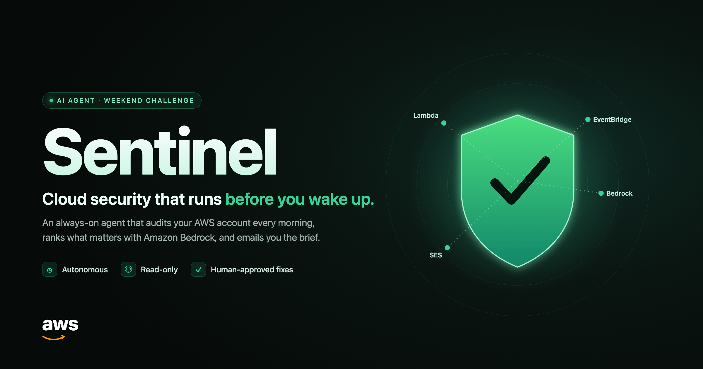
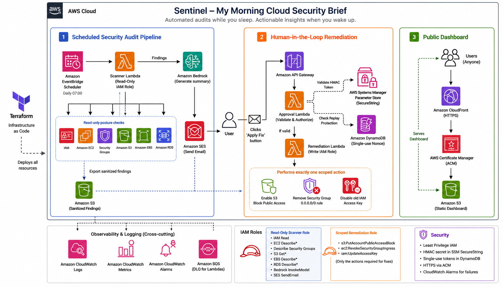
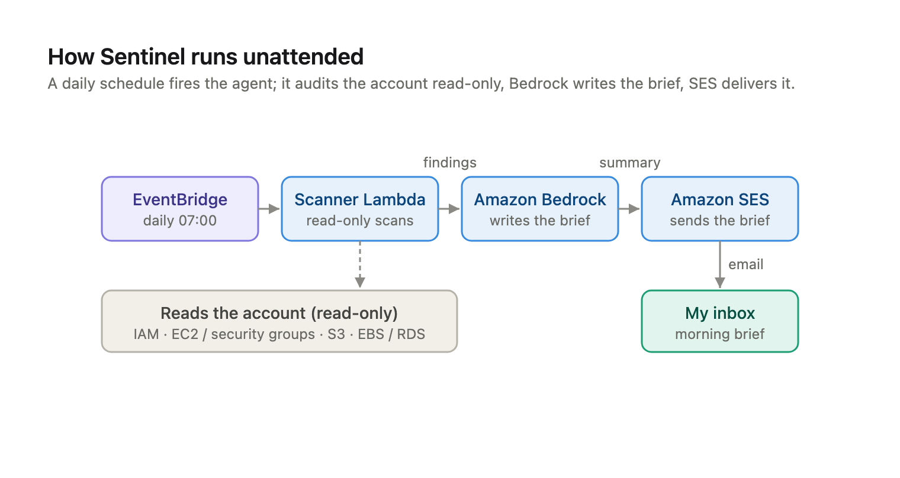
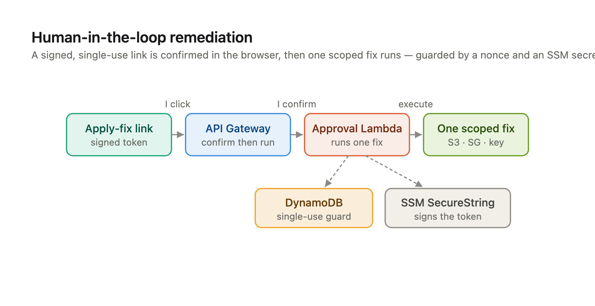
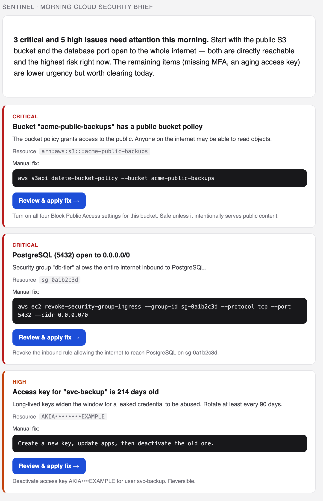
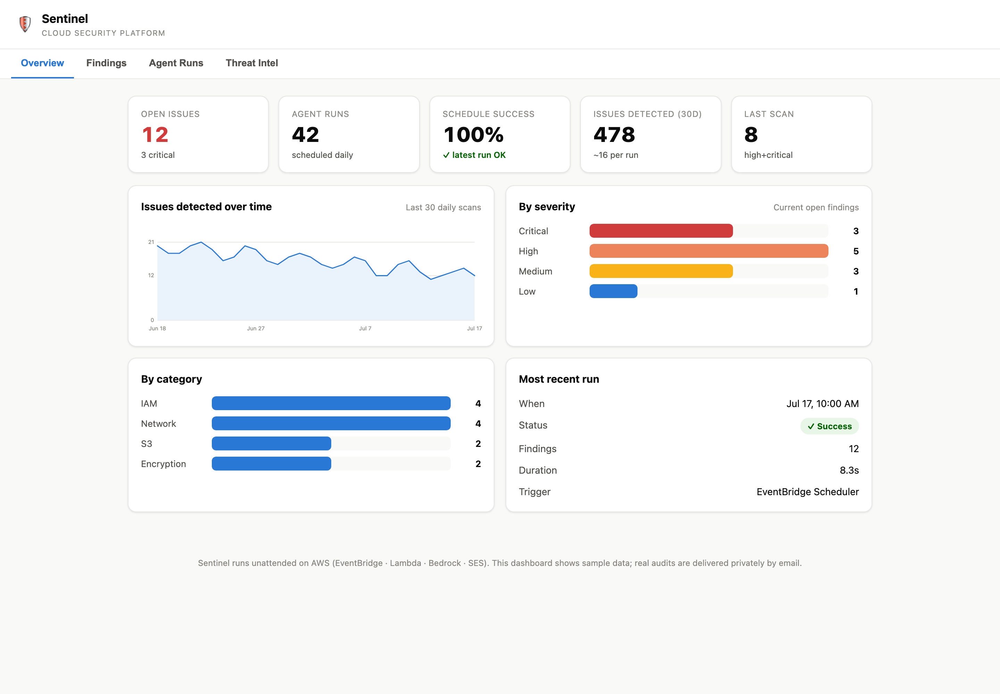
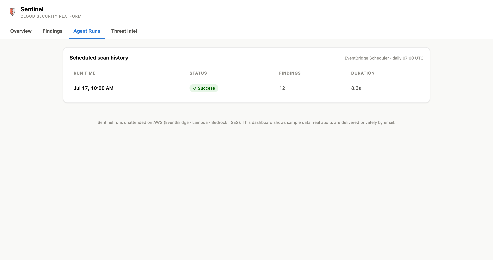

# Sentinel — Morning Cloud Security Brief



An **always-on agent** that audits your AWS account while you sleep and emails you a
prioritized security brief every morning. Findings that are safe to fix come with a
one-click **"Apply fix"** link that runs a single, scoped remediation — only after
you click and confirm.

Built for the AWS Builder Center **Build an Always-On Agent** weekend challenge.

- **Live dashboard:** https://sentinel.omarfathy.dev
- **Trigger:** Amazon EventBridge Scheduler, daily at 07:00 — no human, no button.

---

## Architecture



Three flows, one account:

1. **Scheduled audit pipeline** — EventBridge Scheduler fires a read-only scanner
   Lambda; Amazon Bedrock ranks the findings and writes the brief; Amazon SES emails it.
2. **Human-in-the-loop remediation** — each "Apply fix" link is a signed, single-use,
   expiring token. It hits API Gateway (which shows a confirmation page), and only on
   confirm does the write-scoped approval Lambda run one fix.
3. **Public dashboard** — a static site on S3 + CloudFront + ACM.

**AWS services:** EventBridge Scheduler · Lambda ×3 (scanner, approval, read API) ·
Amazon Bedrock · Amazon SES · API Gateway (HTTP API) · DynamoDB · SSM Parameter Store ·
S3 · CloudFront · ACM · IAM · CloudWatch Logs. **All defined in Terraform**, split into
`api`, `scanner`, and `dashboard` modules.

<details>
<summary>Simplified flow diagrams</summary>

**Unattended pipeline**



**Human-in-the-loop remediation**



</details>

---

## The morning brief

The agent's primary output: a ranked, plain-English brief in your inbox, with copy-paste
fixes and one-click **Apply fix** buttons for the safe ones.



---

## The dashboard

A public, token-free dashboard visualizes the agent's activity. It runs on **sample
data** on purpose — a public security dashboard should never expose an account's real
vulnerabilities. Real findings are delivered privately by email.





---

## Security design

- **Least privilege, two roles.** The scanner is **read-only** — it cannot change
  anything. Only the approval Lambda can write, and only the three exact actions its
  fixes need (`s3:PutBucketPublicAccessBlock`, `ec2:RevokeSecurityGroupIngress`,
  `iam:UpdateAccessKey`).
- **Signed, expiring, single-use approval links.** Each link carries an HMAC-SHA256
  token over `{finding, resource, expiry}`; the secret lives in SSM as a SecureString. A
  tampered link fails signature verification; a replayed link fails a DynamoDB nonce guard.
- **GET confirms, POST executes.** A mail-security scanner that pre-fetches the link only
  lands on a confirmation page — nothing runs until you POST.
- **Prompt-injection boundary.** Bedrock writes only the human summary; it never
  generates links or actions. Resource names/tags are treated as untrusted data.
- **No secrets in env or state.** The HMAC key is generated by Terraform into SSM
  SecureString and fetched at runtime.

---

## Deploy

Prereqs: Node 20+, Terraform ≥ 1.5, AWS CLI configured for the target account.

```bash
# 1. Configure the target account as a local profile
aws configure --profile challenge
aws sts get-caller-identity --profile challenge   # confirm

# 2. Build the Lambda bundles
cd agent && npm install && npm run build && cd ..

# 3. Configure and deploy
cd infra
cp terraform.tfvars.example terraform.tfvars   # edit profile + emails
terraform init
terraform apply
```

After `apply`, do the three things `terraform output next_steps` prints:

1. **Verify SES identities** — click the AWS verification link in the sender/recipient inbox.
2. **Enable Bedrock model access** — Bedrock console → Model access → enable your model.
3. **Point DNS** at CloudFront (if using the custom-domain dashboard).

Test it now without waiting for the schedule:

```bash
aws lambda invoke --function-name sentinel-scanner \
  --profile challenge --region us-east-1 /tmp/out.json && cat /tmp/out.json
```

Teardown: `cd infra && terraform destroy`.

---

## Layout

```
agent/            TypeScript Lambda source (bundled with esbuild -> ESM)
  src/scanners/   read-only posture checks (iam, network, s3, encryption)
  src/tokens.ts   HMAC sign/verify for approval links
  src/*-handler.ts  the three Lambda entry points
dashboard/        static security-platform dashboard (vanilla JS)
infra/            Terraform, split into modules/{api,scanner,dashboard}
docs/images/      diagrams and screenshots
```

## License

MIT — see [LICENSE](LICENSE).
